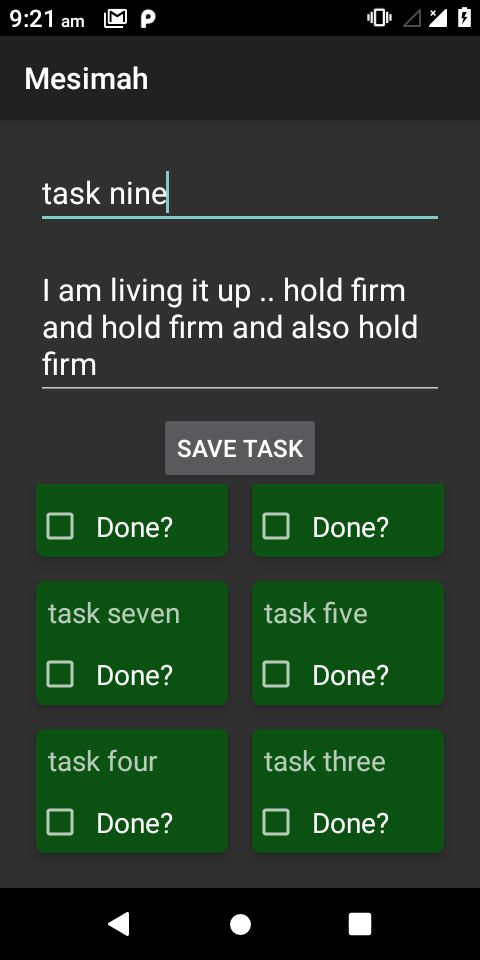

Mesimah Manager is an Android application that allows users to manage their tasks efficiently.
Users can add tasks with a title, description, and date range (start date and end date). 
The app utilizes Room Database for data persistence, List Adapter with DiffUtil.ItemCallback for efficient list handling, 
ViewModel for lifecycle management, and two-way data binding for interactive UI components.

Features

Add Task: Users can add a task with a title, description, start date, and end date.
Edit Task: Users can edit existing tasks.
Delete Task: Users can delete tasks.
View Tasks: A list of tasks is displayed efficiently using a RecyclerView with List Adapter and DiffUtil.ItemCallback.
Architecture
The app follows the MVVM (Model-View-ViewModel) architecture pattern to separate concerns and enhance testability.

Technologies Used

Room Database: For local data storage.
ViewModel: For managing UI-related data in a lifecycle-conscious way.
LiveData: For observing data changes.
RecyclerView: For displaying task list.
List Adapter and DiffUtil.ItemCallback: For efficient list handling.
Two-Way Data Binding: For interactive UI components.
Material Components: For modern UI design

